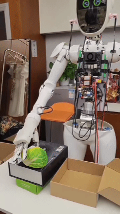
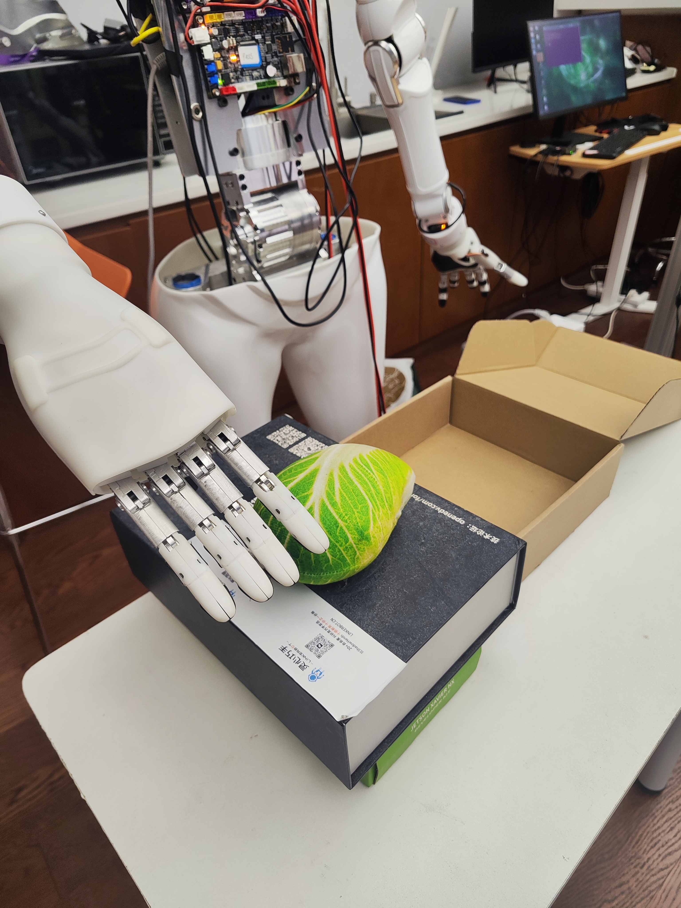
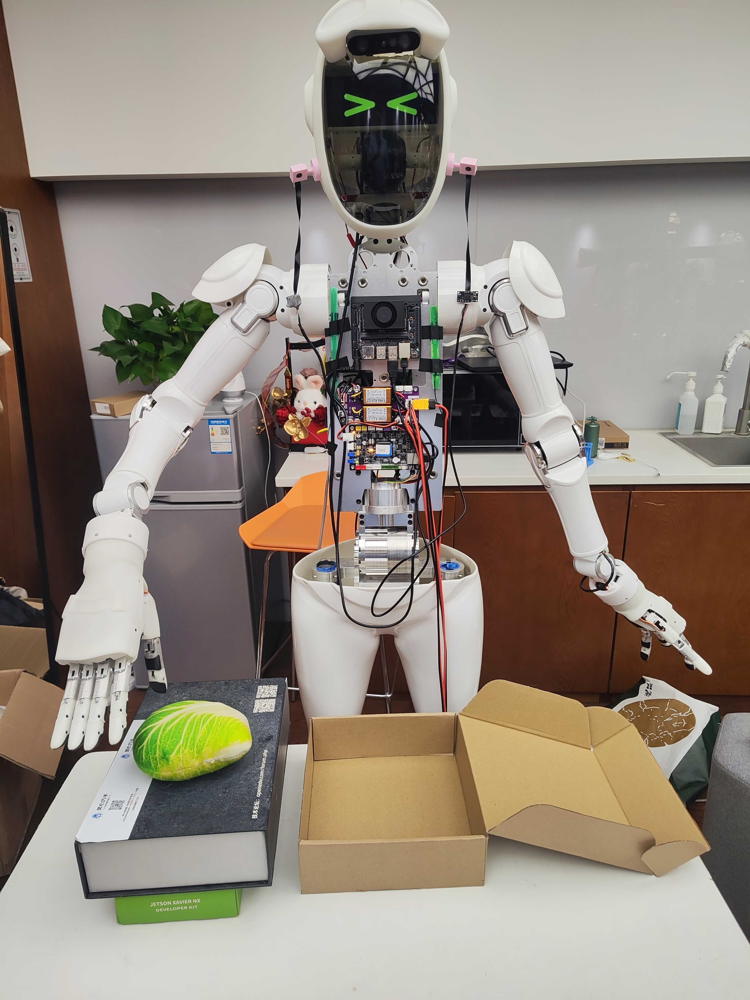

# **Human-Dex**

## **Introduction**
Human-Dex extends use Linkerbot humanoid robot with 2 dex-hands。Collect data through LinkerRobot's teleoperation system (including teleoperation of the robotic arm and dexterous hand), train using HumanPlus's model, and execute on the actual machine.

This codebase contains data record implementation, train, eval with humanplus model




## **Repo Structure**
/src: a ros package used to subscribe rostopic from robot hardware
humanplus: python code for imitation train and eval

## **Installation**

This code validates on ubuntu 20.04 with ROS noetic
1. Install python dependency
```sh
cd human-dex
pip3 install -r requirements.txt
```
2. Install ROS noetic 
3. Create workspace directory，such as: ~/your_ws
4. Clone repo and copy src in recorddata to workspace，such as : ~/your_ws/src
5. source /opt/ros/noetic/setup.sh 
6. run catkin_make inside ~/your_ws, make sure the build is successful
7. source ~/your_ws/devel/setup.sh

## **Run**

1. Data collection

1.1 Run record node
```sh
 roslaunch record_hdf5 record_hdf5.launch
```
Here you need create a data collect directory according  task data_columbus_test's config in record_hdf5/scripts/utils/constants.py 

1.2 Start record data (type support:humanplus and aloha)
```sh
rostopic pub /record_hdf5 std_msgs/String "data: '{\"method\":\"start\",\"type\":\"humanplus\"}'"
```
data will be saved at /home/nx/ROS/robot_internal_srv/collection_data/hdf5/humanplus_hdf5. (You need change the default file store path in src/record_hd5/scripts/utils/constants.py according to your task name)
(Note: you need prepare hardware publish related topics)

2. Train
This step must run with 32G video memory GPU PC.
```sh
cd humanplus/scripts/utils/HIT

python3 imitate_episodes_h1_train.py --task_name data_cb_grasp --ckpt_dir cb_grasp/ --policy_class HIT --chunk_size 50 --hidden_dim 512 --batch_size 48 --dim_feedforward 512 --lr 1e-5 --seed 0 --num_steps 100000 --eval_every 1000 --validate_every 1000 --save_every 1000 --no_encoder --backbone resnet18 --same_backbones --use_pos_embd_image 1 --use_pos_embd_action 1 --dec_layers 6 --gpu_id 0 --feature_loss_weight 0.005 --use_mask --data_aug
```
The trained model path is:
/home/nx/ROS/humanplus/src/humanplus_ros/scripts/utils/cb_grasp/

Note:you need create trained policy directory according task data_cb_grasp's config in humanplus/scripts/utils/HIT/constants.py
Please follow [humanplus](https://github.com/MarkFzp/humanplus) project to install related cuda, torch components.

3. Eval
```sh
cd humanplus/scripts

python3 cb.py
```

# **Hardware**
1. [LinkerBot Humanoid Robot](www.linkerbot.cn) 1
2. [LinkerBot L10 DexHand](www.linkerbot.cn) 2
3. [LinkerBot Teleop system with glove](www.linkerbot.cn) 1