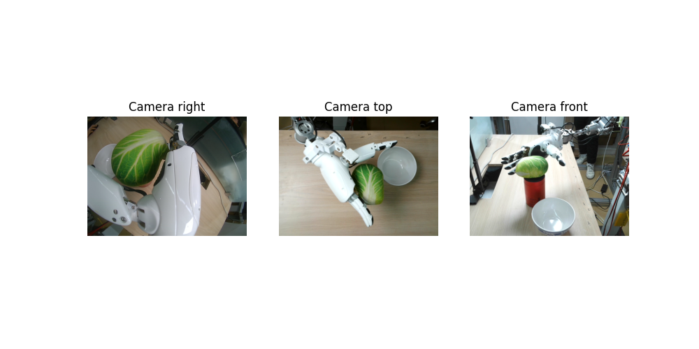
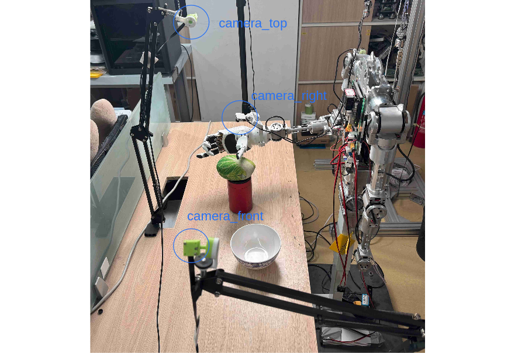

# **Human-Dex**

## **Introduction**
Human-Dex extends use Linkerbot humanoid robot with 2 dex-hands。Collect data through LinkerRobot's teleoperation system (including teleoperation of the robotic arm and dexterous hand), train using HumanPlus's model, and execute on the actual machine.

This codebase contains data record implementation, train, eval with humanplus model

Our task is to use the right hand and arm unilaterally to pick up the cabbage toy on top of the red tea canister and place it into the bowl on the left.

Our experimental setup is as follows: there are three cameras positioned above the scene, on the left side of the scene, and on the wrist (a fisheye camera).







## **Repo Structure**
/recorddata/src: a ros package used to subscribe rostopic from robot hardware to record data.
/camera_top_front_ros_node_ws/src: a ros package to subscribe rostopic from camera. 
humanplus: python code for imitation train and eval

## **Installation**

This code validates on ubuntu 20.04 with ROS noetic
1. Install python dependency
```bash
    conda create -n HIT python=3.8.10
    conda activate HIT
    pip install torchvision
    pip install torch
    pip install pyquaternion
    pip install pyyaml
    pip install rospkg
    pip install pexpect
    pip install mujoco==2.3.7
    pip install dm_control==1.0.14
    pip install opencv-python
    pip install matplotlib
    pip install einops
    pip install packaging
    pip install h5py
    pip install ipython
    pip install getkey
    pip install wandb
    pip install chardet
    pip install h5py_cache 
    pip install pyagxrobots==0.8.4
    cd humanplus/scripts/utils/HIT/detr && pip install -e .
```
2. Install ROS noetic 
```sh
wget http://fishros.com/install -O fishros && . fishros
```
## **Rosnode for camera**
1. run `catkin_make` inside `./camera_top_front_ros_node_ws`, make sure the build is successful.[Maybe error](https://blog.csdn.net/weixin_44857882/article/details/124296306)
2. run `source devel/setup.sh`
3. run `rosrun camera_node multi_rgb_camera.py`,start this node to begin receiving camera data.

## **Rosnode for record**
1. run `catkin_make` inside `./recorddata`, make sure the build is successful.[Maybe error](https://blog.csdn.net/weixin_44857882/article/details/124296306)
2. run `source devel/setup.sh`,complete the setup and construction of the data record ROS node, and follow these steps to collect data.

## **Run**

1. Data collection

1.1 Run record node inside `./recorddata`
```sh
rosrun record_hdf5 record_hdf5.py
```
Set task parameters in src/record_hdf5/scripts/utils/constants.py.

1.2 Start record data (type support:humanplus and aloha)
```sh
rostopic pub /record_hdf5 std_msgs/String "data: '{\"task\":\"data_baicai_grasp\",\"method\":\"start\",\"type\":\"humanplus\"}'"
```
After one data recording is completed, press Ctrl+C to cancel, and then repeat this command to automatically record the next set of data.
(Note: you need prepare hardware publish related topics)

2. Train
This step must run with 32G video memory GPU PC.
```sh
cd humanplus/scripts/utils/HIT

python3 imitate_episodes_h1_train.py --task_name data_baicai_grasp --ckpt_dir cb_grasp/ --policy_class HIT --chunk_size 50 --hidden_dim 512 --batch_size 24 --dim_feedforward 512 --lr 1e-5 --seed 0 --num_steps 100000 --eval_every 1000 --validate_every 1000 --save_every 1000 --no_encoder --backbone resnet18 --same_backbones --use_pos_embd_image 1 --use_pos_embd_action 1 --dec_layers 6 --gpu_id 0 --feature_loss_weight 0.005 --use_mask --data_aug
```
The trained model path is:
/home/nx/ROS/humanplus/src/humanplus_ros/scripts/utils/cb_grasp/

Note:you need change trained policy directory of data_baicai_grasp's config in humanplus/scripts/utils/HIT/constants.py


3. Eval
```sh
cd humanplus/scripts

python3 cb.py --ckpt_dir /home/moning/project/human-dex/humanplus/scripts/utils/HIT/cb_grasp/_data_baicai_grasp_HIT_resnet18_True 
```

# **Hardware**
1. [LinkerBot Humanoid Robot](www.linkerbot.cn) 1
2. [LinkerBot L20 DexHand](www.linkerbot.cn) 2
3. [LinkerBot Teleop system with glove](www.linkerbot.cn) 1
